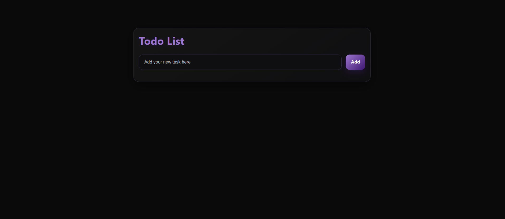

# ✅ Todo Application 

This is the **second version** of my Todo Application.  
The first version was built using **HTML and JavaScript** with only the basic add-task functionality.  

In this updated version, I have made some improvements:  
- 🎨 Added **CSS styling** for a better and clean UI  
- 🗑️ Added a **Delete button** to remove tasks easily  

  --- 

## 🚀 Live Demo
[[Click here to try the app](https://todo-ourdeepak.netlify.app)] 

---

## 📸 Preview

